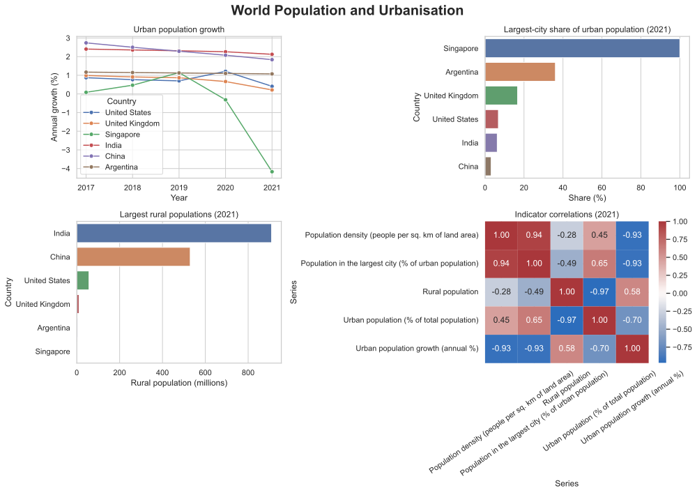
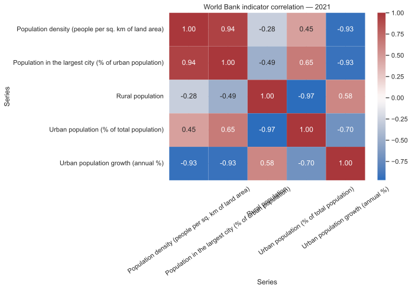

# World Population and Urbanisation Visualisation

A reproducible visual-analysis project using World Bank indicator exports to compare urban growth, rural population and concentration in major cities.

## Questions explored

- How did urban population growth change across the selected countries?
- Which countries had the highest share of urban residents concentrated in their largest city?
- How did rural-population levels differ across the sample?
- How strongly were the selected indicators related in the latest comparable year?

## Visual outputs

| Executive dashboard | Indicator correlation |
|---|---|
|  |  |

## Run locally

```bash
python -m venv .venv
source .venv/bin/activate
pip install -r requirements.txt
python src/analyse_population.py --data data/world_population_data.csv --output artifacts
```

The input should be a World Bank CSV export containing `Country Name`, `Series Name` and year columns such as `2019 [YR2019]`.

## Skills demonstrated

Python, pandas, data cleaning, reshaping, comparative analysis, correlation analysis, seaborn and stakeholder-oriented visualisation.

## Data source

World Development Indicators, World Bank. The repository documents the schema but does not claim ownership of the source data.

## Author

**Gokul Anand Srinivasan**  
[Portfolio](https://gokulanand2307.github.io/) | [GitHub](https://github.com/GokulAnand2307)

